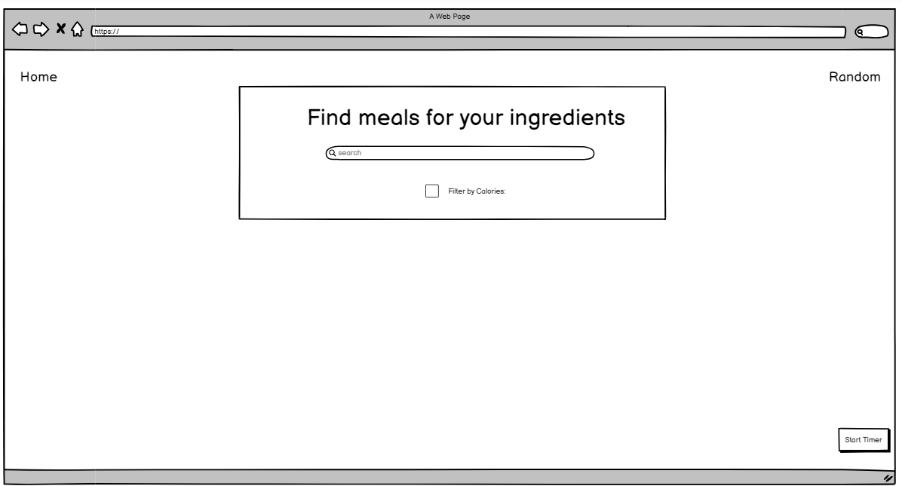

                                                        # FeastFinder - Your Guide to Gastronomic Greatness

**Brief description of the project**

We are group 101 and our project is called FeastFinder. It is a dynamic recipe management system which combines cooking and web development. The project is driven by a two Flask servers (back end and front end) and uses the Spoonacular API for fetching recipes. Additionally, it leverages multiple custom made classes and functions to ensure persistance and enable CRUD operations. Using CSS, HTML, JavaScript and Bootstrap, our frontend provides a responsive and visually appealing UI, featuring interactive elements like cooking timers, brice breakdown plots, calorie filters and more. Through this project, we aimed to create a user-friendly and distinctive recipe application that elevates the cooking experience and reflects our passion towards both technology and culinary delights.

**Frontend mockup**

**Team members**

Márton Bodó

**Installation details**

**Architecture**

The repository for this project consists of 2 folders (back end, front end) and this README file.
The folder architecture can find bellow:

